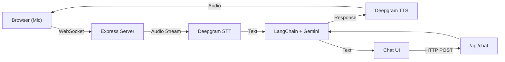

<p align="center">
  
</p>

<h1 align="center">🛸 MAITRI</h1>

<p align="center">
  <strong>Mental and Adaptive Intelligence for Therapeutic Response and Integration</strong>
</p>

<p align="center">
  <em>An AI-powered mental health companion designed for astronauts aboard the Bhartiya Antariksh Station</em>
</p>

<p align="center">
  
  
  
  
  
</p>

---

## 🎬 Demo

<!--
📹 ADD YOUR DEMO VIDEO HERE
Replace the placeholder below with your actual demo video.
Options:
1. YouTube/Vimeo embed link
2. GIF recording of the application
3. Video file in the repository
-->

<p align="center">
  <a href="YOUR_DEMO_VIDEO_LINK_HERE">
    
  </a>
</p>

<!-- Uncomment and use one of these options for your demo video:

### Option 1: YouTube Embed
[](https://www.youtube.com/watch?v=YOUR_VIDEO_ID)

### Option 2: GIF Demo


### Option 3: Video File
https://github.com/YOUR_USERNAME/maitri/assets/demo/demo.mp4

-->

---

## 🌟 Features

| Feature                         | Description                                                                |
| ------------------------------- | -------------------------------------------------------------------------- |
| 💬 **AI Chat Interface**        | Text-based conversations with emotion-aware responses and Markdown support |
| 🎙️ **Real-time Voice Mode**     | Bidirectional voice communication using WebSocket with STT & TTS           |
| 🔮 **3D Interactive Orb**       | Audio-reactive visualization using Three.js that responds to voice input   |
| 🧘 **Therapeutic Techniques**   | Evidence-based grounding, breathing exercises, and mindfulness guidance    |
| 🚨 **Critical Issue Detection** | Recognizes severe distress and recommends escalation protocols             |
| 😊 **Emotion Detection**        | _(Planned)_ Camera integration for facial expression analysis              |

---

## 🏗️ Architecture



| Component    | Technology                                            |
| ------------ | ----------------------------------------------------- |
| **Frontend** | React 19, Vite, React Three Fiber, Three.js           |
| **Backend**  | Node.js, Express, WebSocket (ws)                      |
| **AI/ML**    | Google Gemini 2.5 Flash, LangChain                    |
| **Voice**    | Deepgram Nova-2 (STT), Deepgram Aura (TTS)            |
| **3D**       | @react-three/fiber, @react-three/drei, postprocessing |

---

## 🚀 Quick Start

### Prerequisites

- Node.js v18+
- npm or yarn
- API Keys for:
  - [Google AI Studio](https://aistudio.google.com/) (Gemini API)
  - [Deepgram](https://deepgram.com/) (Speech-to-Text & Text-to-Speech)

### Installation

1. **Clone the repository**

   ```bash
   git clone https://github.com/YOUR_USERNAME/maitri.git
   cd maitri
   ```

2. **Setup Backend**

   ```bash
   cd backend
   npm install
   ```

   Create a `.env` file:

   ```env
   PORT=5000
   GOOGLE_API_KEY=your_gemini_api_key
   DEEPGRAM_API_KEY=your_deepgram_api_key
   ```

3. **Setup Frontend**

   ```bash
   cd ../frontend
   npm install
   ```

4. **Run the Application**

   Terminal 1 (Backend):

   ```bash
   cd backend
   npm run dev
   ```

   Terminal 2 (Frontend):

   ```bash
   cd frontend
   npm run dev
   ```

5. **Open in Browser**

   Navigate to `http://localhost:5173`

---

## 📁 Project Structure

```
maitri/
├── frontend/
│   ├── src/
│   │   ├── components/     # React components
│   │   │   ├── ChatPage/   # Chat interface
│   │   │   └── Orb/        # 3D orb visualization
│   │   ├── pages/          # Route pages
│   │   ├── audio/          # Audio handling utilities
│   │   └── hooks/          # Custom React hooks
│   └── package.json
│
├── backend/
│   ├── services/           # AI chain & voice services
│   ├── routes/             # API routes
│   ├── config/             # Configuration
│   └── server.js           # Express + WebSocket server
│
└── README.md
```

---

## 🎯 Use Cases

- 🚀 **Space Missions** - Mental health support for astronauts during long-duration missions
- 🏥 **Telemedicine** - AI-assisted therapeutic conversations in remote areas
- 🧠 **Mental Wellness** - Daily emotional check-ins and stress management
- 🎓 **Research** - Human-AI interaction studies for isolated environments

---

## 🛠️ API Endpoints

| Endpoint    | Method    | Description                    |
| ----------- | --------- | ------------------------------ |
| `/api/chat` | POST      | Send text message to MAITRI AI |
| `/ws/voice` | WebSocket | Real-time voice communication  |

---

## 🤝 Contributing

Contributions are welcome! Feel free to:

1. Fork the repository
2. Create a feature branch (`git checkout -b feature/amazing-feature`)
3. Commit your changes (`git commit -m 'Add amazing feature'`)
4. Push to the branch (`git push origin feature/amazing-feature`)
5. Open a Pull Request

---

## 📄 License

This project is licensed under the ISC License.

---

## 🙏 Acknowledgments

- **ISRO** - Inspiration from the Bhartiya Antariksh Station initiative
- **Google** - Gemini AI model
- **Deepgram** - Speech recognition and synthesis
- **Three.js Community** - 3D visualization resources

---

<p align="center">
  Made with ❤️ for the future of space exploration
</p>

<p align="center">
  <a href="#-demo">Demo</a> •
  <a href="#-features">Features</a> •
  <a href="#-quick-start">Quick Start</a> •
  <a href="#-contributing">Contributing</a>
</p>
